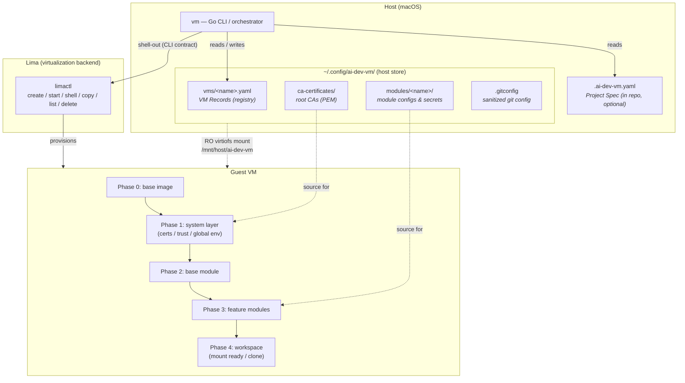
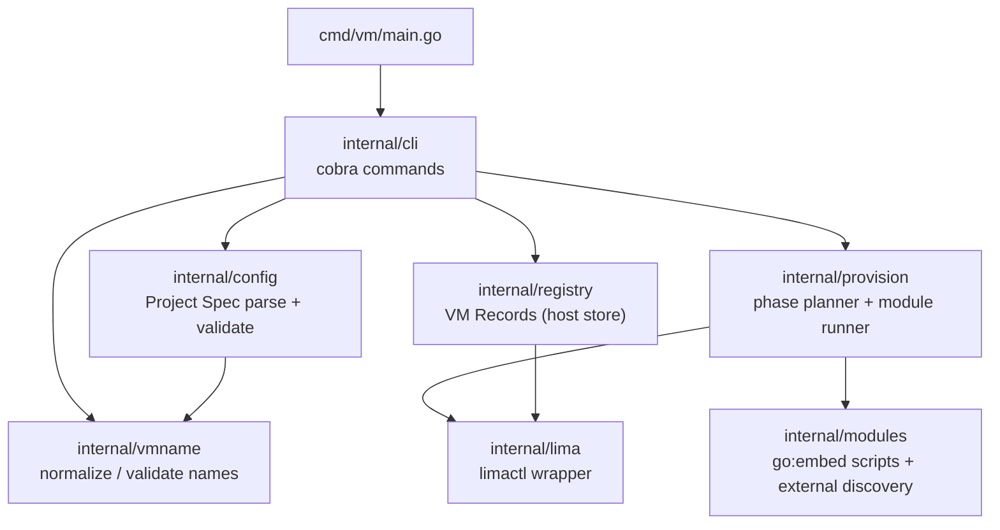
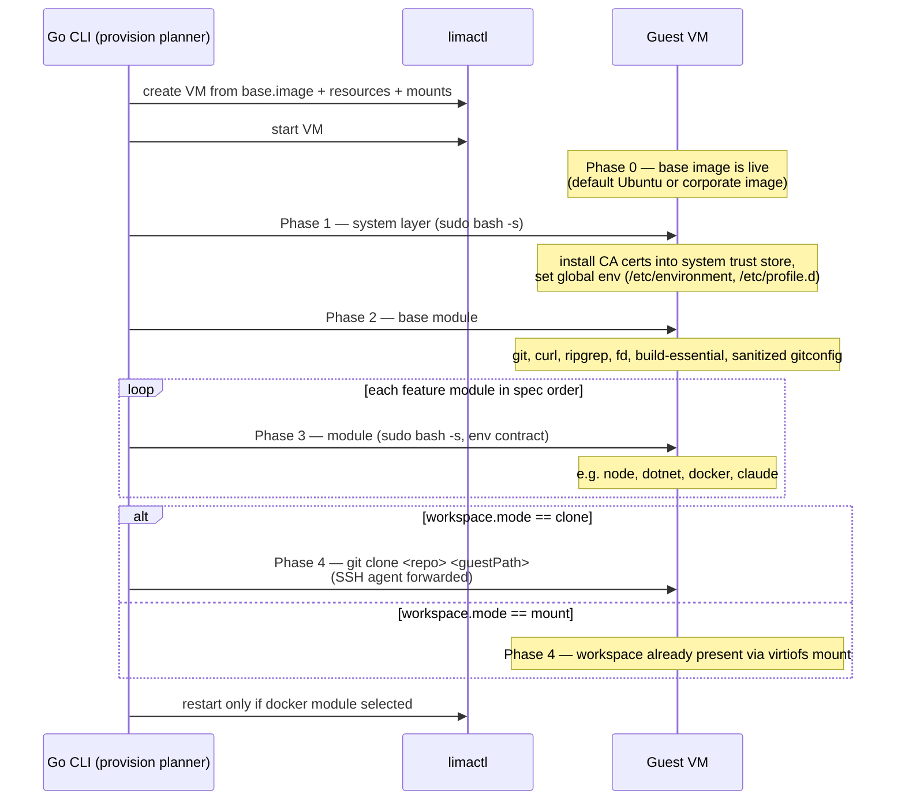
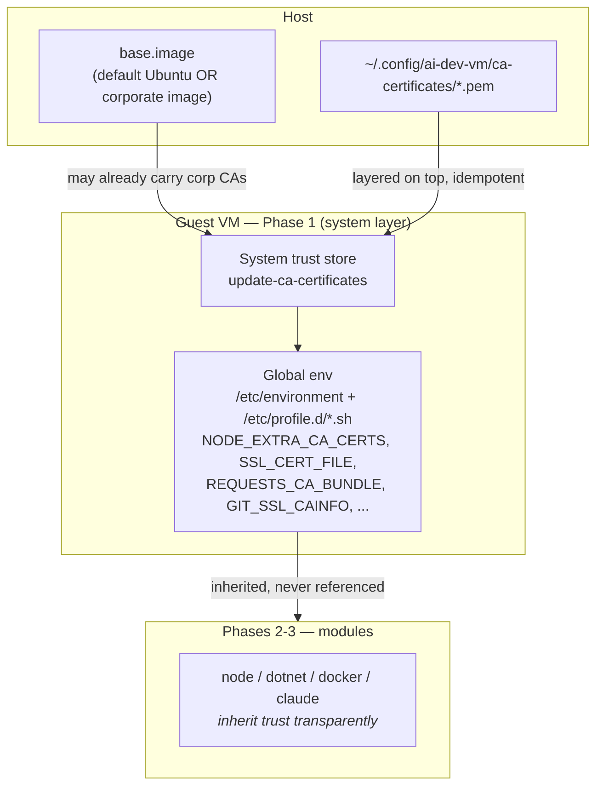
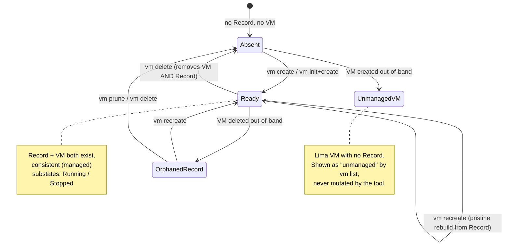
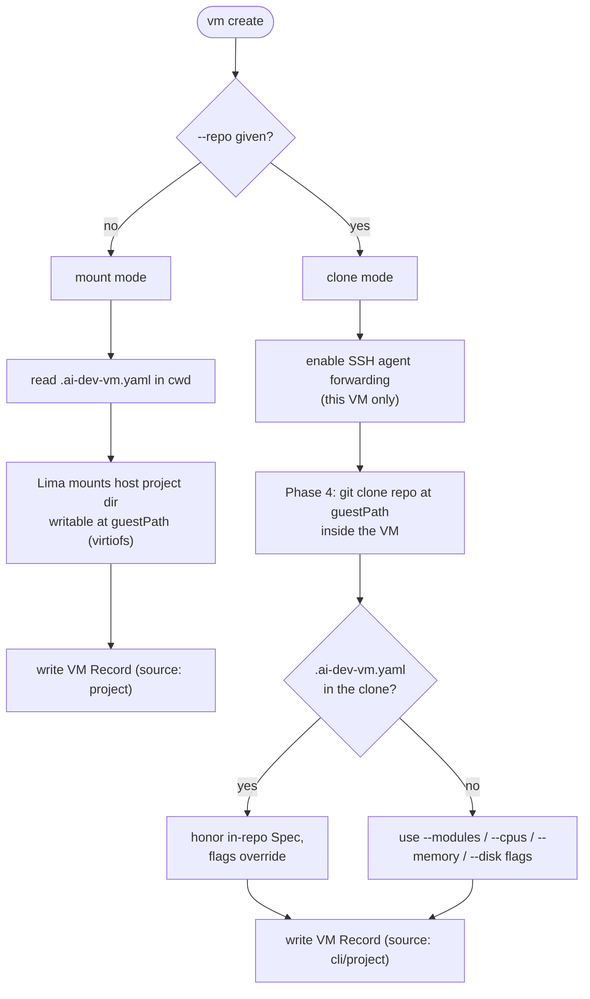

# ai-dev-vm — Architecture

`ai-dev-vm` provisions isolated Linux development VMs on macOS via [Lima](https://lima-vm.io/) — one VM per project, each carrying only the tools that project selects. The system is organized as three layers with narrow interfaces: a **Go CLI** orchestrates, **Lima** virtualizes, and **bash** provisions inside the guest.

## Design principles

- **Three clean layers.** Go orchestrates, Lima virtualizes, bash provisions. Each speaks to the next through a narrow, stable interface.
- **Modules stay dumb.** Cross-cutting concerns (certificates, trust, global env) are applied by dedicated provisioning phases *around* modules, never by the modules themselves.
- **Declarative source vs realized state.** A portable, version-controlled *Project Spec* expresses intent; a host-local *VM Record* is its materialization. This mirrors the manifest-vs-lockfile / Terraform config-vs-state pattern.
- **One managed VM ⇔ one registry record.** They live and die together; divergence (drift) is detected and reconciled, never assumed away.
- **Single self-contained binary.** Provisioning scripts and templates are embedded into the binary; the only runtime dependency is Lima.

## 1. High-Level Architecture

Three layers plus a host-side state/config store.



**Layer boundaries:**

| Layer | Responsibility | Interface to next layer |
|-------|----------------|-------------------------|
| Go CLI | Parse config, manage the registry, plan provisioning, drive lifecycle | `limactl` subprocess calls (stable CLI contract) |
| Lima | Create/run VMs, mounts, SSH, exec | Bash executed in guest via `limactl shell ... sudo bash -s` |
| Bash provisioning | Install software, configure the guest | Guest env contract (see §5) |

## 2. CLI Language: Go

Go is the language of the CLI orchestrator.

| Concern | Choice | Rationale |
|---------|--------|-----------|
| Language | **Go** | Lima is itself Go; trivial cross-compilation to a single static binary; mature CLI ecosystem (cobra); `go:embed` packages provisioning scripts into the binary. |
| Lima integration | **Shell out to `limactl`**, not a library import | Lima exposes no stable public Go API; internal packages change between releases. The `limactl` CLI contract is stable. |
| Provisioning driver | **Go drives the phases** via `limactl shell <vm> sudo bash -s` (stdin), rather than Lima `provision:` blocks | Go controls ordering, per-phase status, error handling, and reconciliation; better diagnostics and rollback. |
| Module packaging | **`go:embed` for built-in modules + templates**, plus runtime discovery of an external module directory | A single self-contained binary for distribution, without losing extensibility for custom modules. |
| Config parsing | **Native Go structs + `gopkg.in/yaml.v3`**, validation in Go | Type-safe, unit-testable validation; the only runtime dependency stays Lima. |
| CLI framework | **cobra** | De-facto standard for subcommands, flags, and help. |
| Distribution | Prebuilt binaries + Homebrew tap (and `go install`) | Single binary; Lima is the only external dependency. |

### Go package structure



Dependency rule: `internal/lima` is the only package that knows about `limactl`; everything else speaks in domain types. `internal/modules` is the only package that knows the embedded/on-disk layout of the bash scripts.

## 3. Configuration Model: Project Spec vs VM Record

The system has **two** config artifacts with distinct, non-overlapping roles. This separation is the backbone of clone mode and of the registry invariant.

| | `.ai-dev-vm.yaml` — **Project Spec** | `~/.config/ai-dev-vm/vms/<name>.yaml` — **VM Record** |
|---|---|---|
| Author | human | the tool |
| Location | in the repo, under version control | host-local, never shared |
| Role | *intent* — what kind of VM this project wants | *materialization* — what VM actually exists on this host |
| Contains | modules, resources, `base.image`, workspace mode | the resolved spec **plus** create-time facts: absolute host path (mount) or repo URL + ref + in-guest path (clone), resolved base image, `source: project\|cli`, VM name, created-at |
| Portable | **yes** — moves config between people and machines | no — local instance state |
| May be absent | yes (clone from a bare repo) | no — always present for a managed VM |

The Project Spec is the *source*; the VM Record is a *self-contained snapshot* of it. `vm create` reads a Spec (from a file or from flags) and writes a Record. Because the Record is self-contained, `recreate`, `list`, and reconciliation work **without** the repo or the current directory, identically for mount and clone modes.

**Config resolution order (one mental model for `vm create`):**

```
flags  >  in-repo .ai-dev-vm.yaml  >  built-in defaults
```

**Transferring config between users** goes through the Project Spec, never the Record. For a mount / shared project, a colleague clones the repo and runs `vm create` to get an equivalent VM (the in-repo file is required for this). For a clone / bare repo, the portable artifact is either the `vm create --repo=... --modules=...` invocation, or a `.ai-dev-vm.yaml` committed into that repo — `vm create --repo=URL` clones first and then honors the in-repo Spec if present (flags still override it).

### Example — Project Spec (`.ai-dev-vm.yaml`)

```yaml
# Authored by a human, committed to the repo.
modules:
  - node
  - claude
resources:
  cpus: 4
  memory: 8GiB
  disk: 120GiB
# Optional: pin a base image (e.g. a corporate one). Defaults to Ubuntu.
# base:
#   image: corp-ubuntu-2204-hardened
# Optional: workspace mode. Defaults to mount.
# workspace:
#   mode: mount
```

### Example — VM Record (`~/.config/ai-dev-vm/vms/my-api.yaml`)

```yaml
# Generated by the tool. Host-local. Mirrors one Lima VM 1:1.
name: my-api
source: cli            # or: project (materialized from an in-repo Spec)
createdAt: "2026-06-14T12:00:00Z"
base:
  image: template:_images/ubuntu
modules: [node, claude]
resources: { cpus: 4, memory: 8GiB, disk: 120GiB }
workspace:
  mode: clone          # or: mount
  # clone mode (an SSH remote is also supported; clone mode forwards the host SSH agent):
  repo: https://github.com/acme/my-api.git
  ref: main
  guestPath: /home/user.linux/my-api
  # mount mode would instead carry:
  # hostPath: /Users/me/projects/my-api
  # guestPath: /home/user.linux/my-api
```

## 4. Provisioning Model — Phases

Provisioning is a fixed sequence of phases, driven from Go. Cross-cutting concerns are isolated into their own phases that run *around* modules, so each module stays focused on installing a single tool.



Phases 1 and 4 isolate the cross-cutting and workspace concerns; phases 2–3 run the modules. The planner owns ordering and per-phase status across the whole sequence.

## 5. Guest Env Contract

Each provisioning script runs as root, with `DEBIAN_FRONTEND=noninteractive`, fed via stdin. The contract is intentionally small.

| Variable | Value | Notes |
|----------|-------|-------|
| `VM_USER` | unprivileged guest user | for `sudo -u` and `usermod` |
| `VM_PROJECT` | project / VM name | naming, labels |
| `VM_WORKSPACE` | absolute path to the code in the guest | mount point (mount) or clone dir (clone) |
| `VM_SECRETS` | `/mnt/host/ai-dev-vm` (read-only) | module configs at `$VM_SECRETS/modules/<name>/` |

Certificates are deliberately *not* in this contract. A module never reads `ca-certificates/` and never sets `NODE_EXTRA_CA_CERTS` — the system layer (Phase 1) has already configured trust globally before any module runs. This is the concrete mechanism by which modules know nothing about certificates.

## 6. Certificate Architecture

Two cooperating levels.



At the **image level**, `base.image` may point at a pre-built corporate image that already carries its own trust configuration; the tool builds on top of it. At the **provision level**, the Phase 1 system layer always installs host-provided CAs from `~/.config/ai-dev-vm/ca-certificates/` into the system trust store and exports trust env vars globally — both in `/etc/profile.d` (login shells: SSH, VS Code) and `/etc/environment` (non-login shells: `limactl shell`). Every later tool and module inherits trust with no per-module code. The tool does not build images; `base.image` consumes an already-prepared image.

## 7. VM Registry & Lifecycle

The registry (`~/.config/ai-dev-vm/vms/<name>.yaml`) holds one VM Record per managed VM. The governing invariant: a managed VM and its registry Record live and die together — there is no Record without a VM, and no managed VM without a Record.

The invariant is a *goal* maintained by a *reconciliation mechanism*, because the world can diverge (someone runs `limactl delete` directly). The source of truth is split: **Lima** owns *existence* (does the VM live?), and the **Registry** owns *definition* (repo, modules, resources, base image, workspace mode). Every command reconciles the two and surfaces drift rather than trusting that state is always consistent.



`vm delete <name>` stops and deletes the VM **and** removes the Record. `vm recreate <name>` reads the Record and rebuilds the VM from scratch (pristine); for **clone** mode this is a fresh re-clone from the remote, so anything not pushed is lost — "commit and push before recreate" is a required discipline, documented at the command. `vm list` reconciles the Registry against Lima and labels each entry: *managed* (consistent), *orphaned* (Record without VM → offer recreate/prune), or *unmanaged* (VM without Record → left untouched).

## 8. Workspace Modes

One `vm create` command, two materializations, unified by the config resolution order (`flags > in-repo file > defaults`).



### mount mode (default — trusted projects)

The host project directory is virtiofs-mounted into the guest, writable. Config comes from the in-repo `.ai-dev-vm.yaml`. Git division of labor: commit/diff/branch in the VM; push/pull on the host where credentials live. A Record is still written, so the VM is manageable by name from anywhere.

### clone mode (code never on the host)

There is no host mount of the project; the code is cloned inside the VM at `VM_WORKSPACE`. Git access uses **SSH agent forwarding, enabled only for clone-mode VMs** (not globally): the host SSH agent socket is forwarded, keys never leave the host, and the VM authenticates to the git host through the forwarded agent for the initial clone and for subsequent push/pull from within the VM. The VM Record is the only durable description of the VM (no in-repo file on the host), which is exactly why the registry exists.

## 9. Command Surface

| Command | Behavior |
|---------|----------|
| `vm init [--modules=… --cpus=… --memory=… --disk=…]` | Write a `.ai-dev-vm.yaml` Project Spec (optionally pre-filled). |
| `vm create` | Mount mode from the cwd Spec; write Record + create VM. |
| `vm create --repo=URL [--modules=… --cpus=… --memory=… --disk=… --base-image=…]` | Clone mode; clone repo into the VM; honor in-repo Spec if present, flags override. |
| `vm recreate <name>` | Pristine rebuild of the VM from its Record. |
| `vm list` | Reconcile Registry ↔ Lima; label managed / orphaned / unmanaged. |
| `vm shell <name>` | Open a shell in the VM (defaults to the workspace dir). |
| `vm start / stop / restart <name>` | Lifecycle controls. |
| `vm delete <name>` | Stop + delete the VM **and** remove its Record. |

### Target resolution (uniform across all `vm *` commands)

```
1. explicit name argument           e.g. `vm shell my-api`
2. else .ai-dev-vm.yaml in cwd       e.g. `vm shell`  (name = dir basename)
3. else error
```

A clone-mode VM with no host-side file is targeted only by name — consistent with rule 1.

### Flags

Resource flags are `--cpus`, `--memory`, `--disk`. `--modules=a,b,c` selects feature modules in order. `--base-image=…` overrides the default base image.

## 10. Repository Layout

```
cmd/vm/main.go              entrypoint
internal/
  cli/                      cobra commands
  config/                   Project Spec schema + validation
  registry/                 VM Records (host store) + reconciliation
  lima/                     limactl wrapper (only limactl-aware package)
  provision/                phase planner + module runner
  modules/                  go:embed bash modules + external discovery
  vmname/                   name normalization / validation
modules/*.sh                bash provisioning (embedded via go:embed)
templates/                  base.yaml and friends (embedded)
```

Built-in modules and templates are embedded into the binary. A host-side module directory (e.g. `~/.config/ai-dev-vm/modules.d/`) is discovered at runtime for user-defined modules, giving a single binary plus extensibility.

## 11. Non-goals

The architecture deliberately does not include: building derived/baked images from within the tool (`base.image` consumes an already-prepared image instead); re-applying modules to a running VM without recreating it (the model is "change config → `vm recreate`"); importing externally-created VMs into the registry; and non-macOS hosts (Lima/virtiofs assumptions hold).

## 12. Key Decisions

| # | Decision |
|---|----------|
| D1 | CLI language is Go. |
| D2 | Integrate Lima by shelling out to `limactl`, not as a library. |
| D3 | Go drives provisioning phases; bash is the in-guest provisioning language. |
| D4 | Built-in modules/templates embedded via `go:embed`; external modules discovered at runtime. |
| D5 | Config parsed natively in Go; Lima is the only runtime dependency. |
| D6 | Certificates handled by a Phase 1 system layer + global env; modules are unaware. |
| D7 | Support a corporate `base.image`; the tool does not build images. |
| D8 | Two-artifact config model: portable Project Spec vs host-local VM Record. |
| D9 | Host registry with a Record ⇔ VM invariant, maintained by reconciliation. |
| D10 | Clone mode uses SSH agent forwarding, enabled per-VM only. |
| D11 | Unified `vm create` (flags > in-repo file > defaults); uniform target resolution. |
