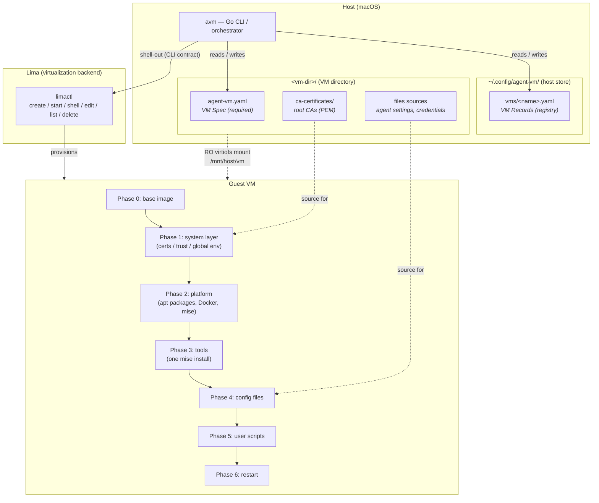
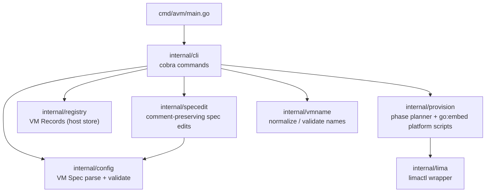
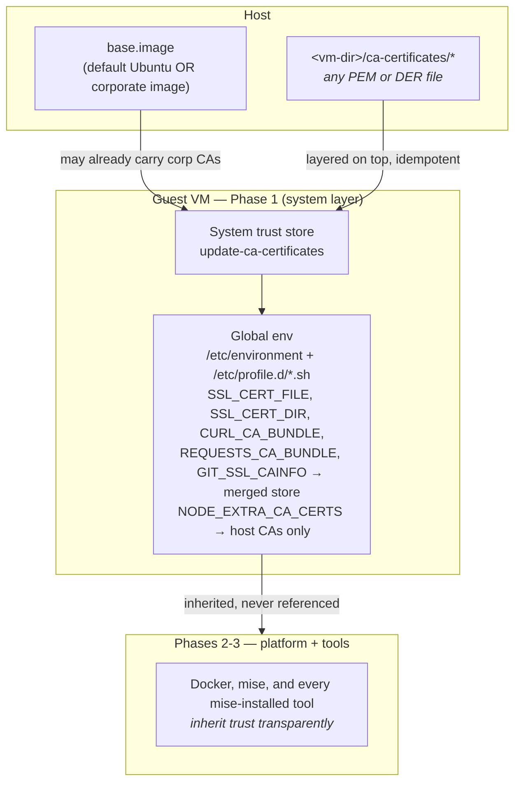

# agent-vm — Architecture

`agent-vm` provisions isolated Linux development VMs on macOS via [Lima](https://lima-vm.io/) — one VM per domain of work, described by its own folder on the host, each carrying only the tools that domain selects. The system is organized as three layers with narrow interfaces: a **Go CLI** orchestrates, **Lima** virtualizes, and **bash** provisions inside the guest.

## Design principles

- **Three clean layers.** Go orchestrates, Lima virtualizes, bash provisions. Each speaks to the next through a narrow, stable interface.
- **Modules are tool references, not scripts.** A module is a [mise](https://mise.jdx.dev/) tool name plus an optional version; installing it is one `mise install` line, not bash the project owns. Cross-cutting concerns (certificates, trust, global env, Docker, mise itself) are applied by platform phases that run *around* the tools phase, never by a module.
- **Declarative source vs realized state.** A portable, human-authored *VM Spec* expresses intent; a host-local *VM Record* is its materialization. This mirrors the manifest-vs-lockfile / Terraform config-vs-state pattern.
- **One managed VM ⇔ one registry record.** They live and die together; divergence (drift) is detected and reconciled, never assumed away.
- **Single self-contained binary.** Provisioning scripts and templates are embedded into the binary; the guest additionally installs a pinned mise release, so the only runtime dependency on the host stays Lima.

## 1. High-Level Architecture

Three layers plus a host-side state/config store.


```mermaid
graph TB
    subgraph Host["Host (macOS)"]
        cli["avm — Go CLI / orchestrator"]
        subgraph Store["~/.config/agent-vm/ (host store)"]
            registry["vms/&lt;name&gt;.yaml<br/><i>VM Records (registry)</i>"]
        end
        subgraph VMDir["&lt;vm-dir&gt;/ (VM directory)"]
            spec["agent-vm.yaml<br/><i>VM Spec (required)</i>"]
            ca["ca-certificates/<br/><i>root CAs (PEM)</i>"]
            cfgfiles["files sources<br/><i>agent settings, credentials</i>"]
        end
    end

    subgraph Lima["Lima (virtualization backend)"]
        limactl["limactl<br/>create / start / shell / edit / list / delete"]
    end

    subgraph Guest["Guest VM"]
        direction TB
        p0["Phase 0: base image"]
        p1["Phase 1: system layer<br/>(certs / trust / global env)"]
        p2["Phase 2: platform<br/>(apt packages, Docker, mise)"]
        p3["Phase 3: tools<br/>(one mise install)"]
        p4["Phase 4: config files"]
        p5["Phase 5: user scripts"]
        p6["Phase 6: restart"]
        p0 --> p1 --> p2 --> p3 --> p4 --> p5 --> p6
    end

    cli -- "reads / writes" --> registry
    cli -- "reads / writes" --> spec
    cli -- "shell-out (CLI contract)" --> limactl
    limactl -- "provisions" --> Guest
    VMDir -. "RO virtiofs mount<br/>/mnt/host/vm" .-> Guest
    ca -. "source for" .-> p1
    cfgfiles -. "source for" .-> p4
```

**Layer boundaries:**

| Layer | Responsibility | Interface to next layer |
|-------|----------------|-------------------------|
| Go CLI | Parse config, manage the registry, plan provisioning, drive lifecycle | `limactl` subprocess calls (stable CLI contract) |
| Lima | Create/run VMs, mounts, SSH, exec | Bash executed in guest via `limactl shell ... sudo bash -s` |
| Bash provisioning | The guest scripts are the platform layer: certificates, apt packages, Docker, mise, config files, restart. Per-tool installation is delegated to mise, driven by one rendered `mise install` rather than a script per tool. | Guest env contract (see §5) |

## 2. CLI Language: Go

Go is the language of the CLI orchestrator.

| Concern | Choice | Rationale |
|---------|--------|-----------|
| Language | **Go** | Lima is itself Go; trivial cross-compilation to a single static binary; mature CLI ecosystem (cobra); `go:embed` packages provisioning scripts into the binary. |
| Lima integration | **Shell out to `limactl`**, not a library import | Lima exposes no stable public Go API; internal packages change between releases. The `limactl` CLI contract is stable. |
| Provisioning driver | **Go drives the phases** via `limactl shell <vm> sudo bash -s` (stdin), rather than Lima `provision:` blocks | Go controls ordering, per-phase status, error handling, and reconciliation; better diagnostics and rollback. |
| Module packaging | **`go:embed` for the platform provisioning scripts and the spec template**; the tools themselves are mise references resolved at provision time, not embedded per-tool scripts | A single self-contained binary for distribution; adding a new tool needs no code change, only a new entry in the Spec's `modules`. |
| Config parsing | **Native Go structs + `gopkg.in/yaml.v3`**, validation in Go | Type-safe, unit-testable validation; the only runtime dependency stays Lima. |
| CLI framework | **cobra** | De-facto standard for subcommands, flags, and help. |
| Distribution | GitHub Releases + `install.sh` (and `go install`) | Single binary; Lima is the only external dependency. The installer can install Lima through an existing Homebrew installation, but does not require a Homebrew tap for `avm`. |

### Go package structure


```mermaid
graph TD
    main["cmd/avm/main.go"]
    cli["internal/cli<br/>cobra commands"]
    config["internal/config<br/>VM Spec parse + validate"]
    specedit["internal/specedit<br/>comment-preserving spec edits"]
    registry["internal/registry<br/>VM Records (host store)"]
    lima["internal/lima<br/>limactl wrapper"]
    provision["internal/provision<br/>phase planner + go:embed platform scripts"]
    vmname["internal/vmname<br/>normalize / validate names"]

    main --> cli
    cli --> config
    cli --> specedit
    cli --> registry
    cli --> provision
    cli --> vmname
    specedit --> config
    provision --> lima
```

Dependency rule: `internal/lima` is the only package that knows about `limactl`; everything else speaks in domain types. `internal/provision` embeds its own platform scripts (`internal/provision/scripts/*.sh`) and renders the `mise install` invocation and the `files`/`scripts` phases directly from the resolved config — there is no separate module-runner package.

`internal/lima`'s `ExecRunner` filters `limactl`'s logrus-formatted stderr before it reaches the terminal: normal mode shows only warnings and errors, `--verbose` shows every line, and both strip the `time=…level=…` prefix (and trailing key=value fields) down to the message text. The raw stderr is still captured separately to build error messages.

## 3. Configuration Model: VM Spec vs VM Record

The system has **two** config artifacts with distinct, non-overlapping roles. This separation is the backbone of the registry invariant.

| | `agent-vm.yaml` — **VM Spec** | `~/.config/agent-vm/vms/<name>.yaml` — **VM Record** |
|---|---|---|
| Author | human | the tool |
| Location | in the VM's own folder | host-local, never shared |
| Role | *intent* — what kind of VM this domain of work wants | *materialization* — what VM actually exists on this host |
| Contains | `name`, `modules`, `resources`, `mounts`, `files`, `scripts`, `base.image` | `configDir`, `home`, `mounts`, resolved `files`, `scripts`, `installedTools`, resolved base image, VM name, created-at |
| Portable | **yes** — between machines where the projects live at the same paths | no — local instance state |
| May be absent | no — `avm create` requires it | no — always present for a managed VM |

The VM Spec is the *source*; the VM Record is a *self-contained snapshot* of it. `avm create` reads a Spec and writes a Record. `avm recreate` re-reads the Spec — the model is "change config → `avm recreate`", so a rebuild must not replay a snapshot that predates the edit prompting it — and rewrites the Record from what it built. Because the Record is self-contained, `recreate` still works **without** the VM directory or the current directory: with no readable Spec it falls back to the snapshot, which is what makes an orphaned Record recoverable on a host that never had the folder. `list` and reconciliation read the Record only.

**Config resolution order (one mental model for `avm create`):**

```
flags  >  agent-vm.yaml  >  built-in defaults
```

**Transferring config between users** goes through the VM Spec, never the
Record. A colleague copies the VM folder and runs `avm create` to get an
equivalent VM, provided their projects live at the paths `mounts` names.

### Example — VM Spec (`agent-vm.yaml`)

```yaml
# Authored by a human, lives in the VM's folder.
name: work
modules:
  - node: lts
  - claude
resources:
  cpus: 4
  memory: 8GiB
  disk: 120GiB
mounts:
  - ~/projects/api
  - ~/projects/web
files:
  claude-settings.json: ~/.claude/settings.json
scripts:
  - provision/postgres.sh
```

Mount paths are absolute or `~/`-prefixed: a VM's contents must not depend on
where its folder sits. The absolute path of the folder itself is a create-time
fact and is recorded as `configDir` in the VM Record.

### Example — VM Record (`~/.config/agent-vm/vms/work.yaml`)

```yaml
# Generated by the tool. Host-local. Mirrors one Lima VM 1:1.
name: work
createdAt: "2026-06-14T12:00:00Z"
user: m_doshevsky           # resolved guest Linux username
configDir: /Users/me/vms/work
home: /home/m_doshevsky.linux
base:
  image: template:_images/ubuntu
modules: [{ node: lts }, claude]
installedTools: [{ node: 22.9.0 }, { claude: 2.1.4 }]  # what mise actually resolved
resources: { cpus: 4, memory: 8GiB, disk: 120GiB }
mounts:
  - { hostPath: /Users/me/projects/api, guestPath: /home/m_doshevsky.linux/api }
files:
  - { rel: claude-settings.json, to: ~/.claude/settings.json }
scripts:
  - provision/postgres.sh
```

## 4. Provisioning Model — Phases

Provisioning is a fixed sequence of phases, driven from Go. Cross-cutting concerns are isolated into their own phases that run *around* the tools phase, so a project's `modules` list drives exactly one thing: which tools `mise install` resolves.

```mermaid
sequenceDiagram
    participant CLI as Go CLI (provision planner)
    participant Lima as limactl
    participant Guest as Guest VM

    CLI->>Lima: create VM from base.image + resources + mounts
    CLI->>Lima: start VM
    Note over Guest: Phase 0 — base image is live<br/>(default Ubuntu or corporate image)

    CLI->>Guest: Phase 1 — system layer (sudo bash -s)
    Note over Guest: install CA certs into system trust store,<br/>set global env (/etc/environment, /etc/profile.d)
    CLI->>Guest: Phase 2 — platform (sudo bash -s)
    Note over Guest: base packages, Docker, mise itself — always installed, never selected by a project

    CLI->>Guest: Phase 3 — tools (sudo bash -s)
    Note over Guest: one rendered `mise install` for every module in the spec,<br/>retried up to three times (mise skips what is installed);<br/>`mise ls -i -J` reports back the resolved versions

    CLI->>Guest: Phase 4 — config files (sudo bash -s)
    Note over Guest: copy each `files` entry from /mnt/host/vm to its guest destination

    loop each entry in spec order
        CLI->>Guest: Phase 5 — user script (sudo bash -s, env contract)
    end

    CLI->>Lima: restart, unconditionally
```

Phases 1 and 4–5 isolate the cross-cutting and project-supplied concerns; phase 3 is the only one that depends on the project's tool selection. The planner owns ordering and per-phase status across the whole sequence, and the restart is unconditional because any provisioned VM may have changed group membership or global env.

## 5. Guest Env Contract

Each provisioning script runs as root, with `DEBIAN_FRONTEND=noninteractive`, fed via stdin. The contract is intentionally small.

| Variable | Value | Notes |
|----------|-------|-------|
| `VM_USER` | unprivileged guest user | for `sudo -u` and `usermod` |
| `VM_HOME` | the guest home | the root of every mounted project |
| `VM_CONFIG` | `/mnt/host/vm` (read-only) | the VM directory: source root for `files` entries and `ca-certificates/` |

Certificates are deliberately *not* in this contract. No platform script or `files`/`scripts` entry reads `ca-certificates/` or sets `NODE_EXTRA_CA_CERTS` — the system layer (Phase 1) has already configured trust globally before anything else runs. This is the concrete mechanism by which tools know nothing about certificates.

## 6. Certificate Architecture

Two cooperating levels.


```mermaid
graph TB
    subgraph Host
        hostca["&lt;vm-dir&gt;/ca-certificates/*<br/><i>any PEM or DER file</i>"]
        baseimg["base.image<br/>(default Ubuntu OR corporate image)"]
    end

    subgraph Guest["Guest VM — Phase 1 (system layer)"]
        trust["System trust store<br/>update-ca-certificates"]
        env["Global env<br/>/etc/environment + /etc/profile.d/*.sh<br/>SSL_CERT_FILE, SSL_CERT_DIR, CURL_CA_BUNDLE,<br/>REQUESTS_CA_BUNDLE, GIT_SSL_CAINFO → merged store<br/>NODE_EXTRA_CA_CERTS → host CAs only"]
    end

    subgraph Tools["Phases 2-3 — platform + tools"]
        m["Docker, mise, and every mise-installed tool<br/><i>inherit trust transparently</i>"]
    end

    baseimg -- "may already carry corp CAs" --> trust
    hostca -- "layered on top, idempotent" --> trust
    trust --> env
    env -- "inherited, never referenced" --> Tools
```

At the **image level**, `base.image` may point at a pre-built corporate image that already carries its own trust configuration; the tool builds on top of it. At the **provision level**, the Phase 1 system layer always installs host-provided CAs from the VM directory's ca-certificates/ into the system trust store and exports trust env vars globally — both in `/etc/profile.d` (login shells: SSH, VS Code) and `/etc/environment` (non-login shells: `limactl shell`). Every later tool inherits trust with no per-tool code. The tool does not build images; `base.image` consumes an already-prepared image.

Three properties of the system layer are load-bearing, because each of them was
the difference between a VM that works behind a TLS-inspecting proxy and one
that fails in Phase 3 with `invalid peer certificate: UnknownIssuer`:

- **Encoding is not the user's problem.** Every regular file in `ca-certificates/`
  is read, whatever it is called, and PEM and DER are both accepted (a corporate
  root CA is handed out as a DER-encoded `.crt` at least as often as a `.pem`).
  Certificates are re-emitted through a normalizer, so a CRLF export or a file
  with no trailing newline cannot corrupt the bundle it is concatenated into. A
  file that is not a certificate is named on stderr; a directory of files with no
  certificate among them fails the phase rather than provisioning a VM that
  cannot talk to anything.
- **Trust is added, never substituted.** `SSL_CERT_FILE` and its siblings
  *replace* a tool's root list. They point at the merged system store
  (`/etc/ssl/certs/ca-certificates.crt`, rebuilt by `update-ca-certificates` with
  the host CAs in it), never at the host CAs alone — otherwise the first host the
  proxy does *not* re-sign fails with the very error a missing CA gives.
  `NODE_EXTRA_CA_CERTS` is the exception: node *adds* it to its built-in roots,
  so it gets the host-CA-only bundle.
- **Inheritance does not depend on PAM.** Phases reach the guest as
  `sudo bash -c`, which is not a login shell and so never reads `/etc/profile.d`;
  whether `/etc/environment` survives `sudo` is a property of the guest image's
  PAM configuration. The provisioning wrapper therefore sources
  `/etc/profile.d/agent-vm-ca.sh` itself when it exists, so Phase 3 — the phase
  that downloads every tool — cannot be the one phase running without trust.

The system layer also runs a non-fatal TLS preflight against the two hosts every
tool comes from (`github.com`, `api.github.com`). A network that inspects TLS
then fails in Phase 1 with one line that names the cause, instead of in Phase 3
inside mise's retry loop, after the point where `avm create` rolls the VM back.

## 7. VM Registry & Lifecycle

The registry (`~/.config/agent-vm/vms/<name>.yaml`) holds one VM Record per managed VM. The governing invariant: a managed VM and its registry Record live and die together — there is no Record without a VM, and no managed VM without a Record.

The invariant is a *goal* maintained by a *reconciliation mechanism*, because the world can diverge (someone runs `limactl delete` directly). The source of truth is split: **Lima** owns *existence* (does the VM live?), and the **Registry** owns *definition* (modules, resources, base image, mounts). Every command reconciles the two and surfaces drift rather than trusting that state is always consistent.

`avm create` writes the VM Record **first**, then builds the VM. On any provisioning failure the VM artifact is deleted (rolled back) but the Record is kept → `OrphanedRecord`, recovered via `recreate`/`prune`. `avm create` refuses a name that already has a Record.


```mermaid
stateDiagram-v2
    [*] --> Absent: no Record, no VM

    Absent --> Ready: avm create (Record written first, then VM built)
    note right of Ready
        Record + VM both exist,
        consistent (managed)
        substates: Running / Stopped
    end note

    Ready --> Ready: start / stop / restart / shell
    Ready --> Absent: avm delete (removes VM AND Record)
    Ready --> Ready: avm recreate (pristine rebuild from Spec)

    Ready --> OrphanedRecord: VM deleted out-of-band
    OrphanedRecord --> Ready: avm recreate
    OrphanedRecord --> Absent: avm prune / avm delete

    Absent --> UnmanagedVM: VM created out-of-band
    note right of UnmanagedVM
        Lima VM with no Record.
        Shown as "unmanaged" by avm list,
        never mutated by the tool.
    end note
```

`avm delete <name>` stops and deletes the VM **and** removes the Record. `avm recreate <name>` rebuilds the VM from scratch (pristine): the mounted host folders are untouched, but anything living only inside the guest — state outside mise, Docker volumes, files written to guest-only directories — is gone. It rebuilds from the VM directory's current `agent-vm.yaml`, falling back to the Record when that folder is absent, and reports which of the two it used; the VM name, guest user and guest home always come from the Record, so a renamed `name:` key cannot redirect the rebuild at a different VM. `avm list` reconciles the Registry against Lima and labels each entry: *managed* (consistent), *orphaned* (Record without VM → offer recreate/prune), or *unmanaged* (VM without Record → left untouched). It also shows Lima runtime state as *running*, *stopped*, or `-` for orphaned records with no backing VM.

## 8. Mounts

Every entry in `mounts` is equal: there is no main project and no privileged
mount. Each host folder is virtiofs-mounted read/write at `~/<name>` in the
guest, where `name` defaults to the folder's basename and can be overridden per
entry when two projects share one. Alongside them, the VM's own directory is
mounted **read-only** at `/mnt/host/vm` — the single service mount, and the only
host folder the guest can read besides the projects themselves.

Git division of labor: commit/diff/branch in the VM; push/pull on the host where
credentials live.

**Runtime changes.** `avm mount` and `avm unmount` attach and detach a project
without recreating the VM. Both write all three artifacts that describe it — the
VM Spec, the Record, and the Lima instance — so none can silently drift from the
others. The Spec is edited through `yaml.Node`, preserving the explanatory
comments `avm init` ships.

Synchronization with Lima is **convergent**, not incremental: the whole list is
rendered from the Record and applied via `limactl edit --set '.mounts = […]'`.
A single convergent primitive serves mount, unmount, and a hand-edited config
alike, instead of three partial ones.

`limactl edit` refuses to operate on a running instance, so the edit can only
happen while the VM is stopped — which also matches the runtime constraint that
Lima attaches virtiofs devices at boot, with no supported way to add one to a
live guest. The two cases are therefore:

- **VM stopped (or absent):** edit the config directly; the new list is attached
  on the next boot. No prompt.
- **VM running:** prompt *before* touching Lima. On accept, `stop → edit →
  start`. On decline, Lima is not touched at all — the VM Spec and the Record
  are already updated, but the change is not applied, and a plain `avm restart`
  will *not* converge it (`avm restart` is a bare `limactl restart` and never
  calls this path). Applying it later means stopping the VM and re-running
  `avm mount`/`avm unmount`, or `avm recreate <name>`.

## 9. Command Surface

| Command | Behavior |
|---------|----------|
| `avm init [path]` | Write an `agent-vm.yaml` VM Spec template. |
| `avm create [path]` | Create + provision the VM from a VM directory's Spec; write Record + create VM. |
| `avm recreate <name>` | Pristine rebuild of the VM from its `agent-vm.yaml` (its Record when that folder is absent). |
| `avm list [name]` | Reconcile Registry ↔ Lima; label managed / orphaned / unmanaged. With a name, show that VM's mounts and tools. |
| `avm mount <vm> [path]` | Attach a project folder; updates Spec, Record and the running VM. |
| `avm unmount <vm> <path\|name>` | Detach a project folder. |
| `avm shell [name]` | Open a shell in the VM (at the guest home, passed to `limactl shell --workdir` from the Record's `home`; without it Lima would try to `cd` into host paths that do not exist in the guest). |
| `avm start / stop / restart [name]` | Lifecycle controls. |
| `avm delete <name>` | Stop + delete the VM **and** remove its Record. |
| `avm prune [name]` | Remove orphaned records (record without a VM). |

### Target resolution (uniform across all `avm *` commands)

```
1. explicit name argument           e.g. `avm shell work`
2. else agent-vm.yaml in cwd        e.g. `avm shell`  (name from `name:`, else dir basename)
3. else error
```

`avm mount` / `avm unmount` require the name explicitly: they are run from a
project folder, which is not the VM's directory.

### Flags

Resource flags are `--cpus`, `--memory`, `--disk`. `--modules=…` takes mise tool
references, e.g. `--modules=node@lts,go@1.24`. `--base-image=…` overrides the
default base image. `avm mount --name <name>` sets the guest directory name when
two projects would otherwise collide.

When no `--modules` flag is set and the Spec has no `modules` key, the built-in default modules `[node, claude]` are installed.

## 10. Repository Layout

```
cmd/avm/main.go             entrypoint
internal/
  cli/                      cobra commands (incl. mount.go, mountsync.go)
  config/                   VM Spec schema + validation
  specedit/                 comment-preserving edits to agent-vm.yaml
  registry/                 VM Records (host store) + reconciliation
  lima/                     limactl wrapper (only limactl-aware package)
  provision/                phase planner + go:embed platform scripts
  vmname/                   name normalization / validation
internal/provision/scripts/*.sh   platform provisioning scripts (go:embed'd into internal/provision)
internal/templates/files/*        Lima base template + agent-vm.yaml spec template
```

The platform provisioning scripts and both templates are embedded into the binary, so `avm` ships as a single file. Per-tool installation needs no code or embedded script of its own — it is a `modules` entry that mise resolves at provision time.

## 11. Non-goals

The architecture deliberately does not include: building derived/baked images
from within the tool (`base.image` consumes an already-prepared image instead);
re-applying modules to a running VM without recreating it (the model is "change
config → `avm recreate`"); hot-attaching a mount without a restart (Lima
attaches virtiofs devices at boot); importing externally-created VMs into the
registry; and non-macOS hosts (Lima/virtiofs assumptions hold).

## 12. Key Decisions

| # | Decision |
|---|----------|
| D1 | CLI language is Go. |
| D2 | Integrate Lima by shelling out to `limactl`, not as a library. |
| D3 | Go drives provisioning phases; bash is the in-guest provisioning language. |
| D4 | Platform provisioning scripts and templates embedded via `go:embed`; per-tool installation delegated to mise, so a new tool needs no code change. |
| D5 | Config parsed natively in Go; Lima is the only runtime dependency. |
| D6 | Certificates handled by a Phase 1 system layer + global env; modules are unaware. |
| D7 | Support a corporate `base.image`; the tool does not build images. |
| D8 | Two-artifact config model: portable VM Spec vs host-local VM Record. |
| D9 | Host registry with a Record ⇔ VM invariant, maintained by reconciliation. |
| D10 | Unified `avm create` (flags > in-repo file > defaults); uniform target resolution. |
| D11 | Mounts converge Record → Lima by rewriting the whole list, not by attaching incrementally. `limactl edit` only works on a stopped instance, so a stopped VM is edited in place, while a running one is `stop → edit → start` behind a confirmation prompt; declining touches Lima not at all. |
