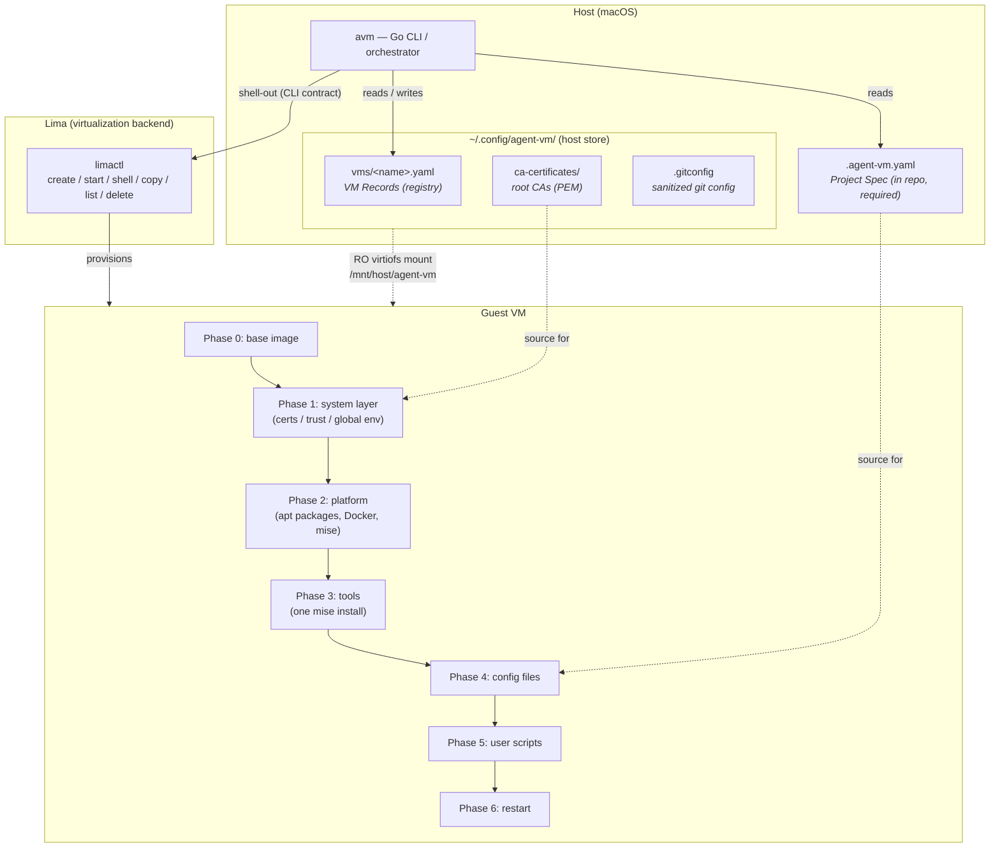
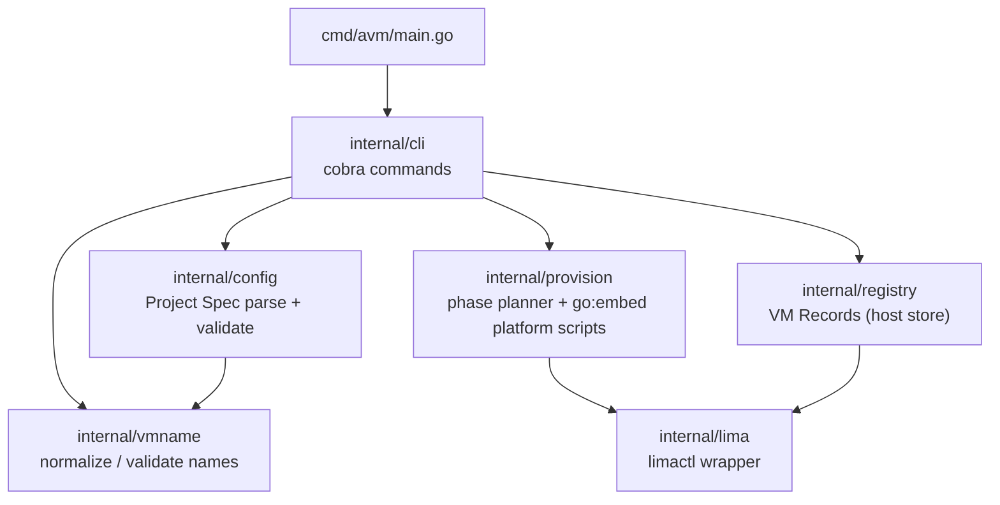
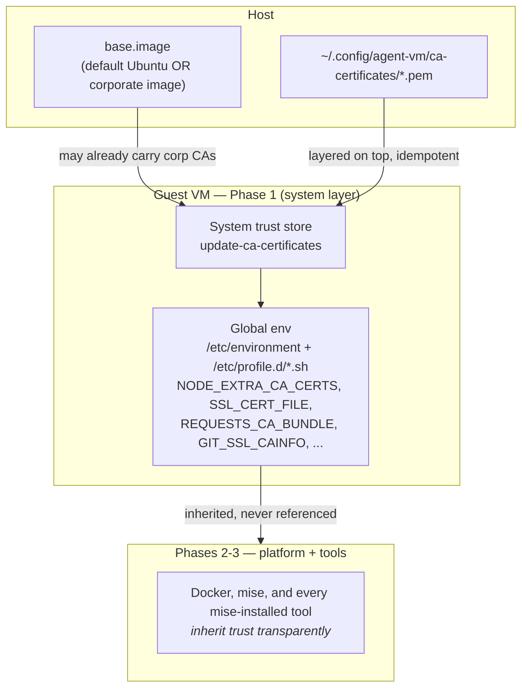
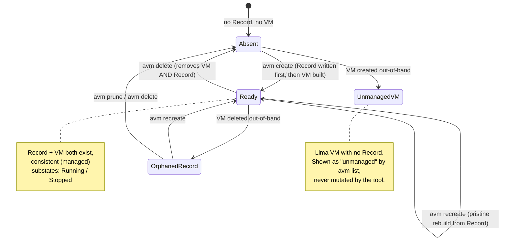

# agent-vm — Architecture

`agent-vm` provisions isolated Linux development VMs on macOS via [Lima](https://lima-vm.io/) — one VM per project, each carrying only the tools that project selects. The system is organized as three layers with narrow interfaces: a **Go CLI** orchestrates, **Lima** virtualizes, and **bash** provisions inside the guest.

## Design principles

- **Three clean layers.** Go orchestrates, Lima virtualizes, bash provisions. Each speaks to the next through a narrow, stable interface.
- **Modules are tool references, not scripts.** A module is a [mise](https://mise.jdx.dev/) tool name plus an optional version; installing it is one `mise install` line, not bash the project owns. Cross-cutting concerns (certificates, trust, global env, Docker, mise itself) are applied by platform phases that run *around* the tools phase, never by a module.
- **Declarative source vs realized state.** A portable, version-controlled *Project Spec* expresses intent; a host-local *VM Record* is its materialization. This mirrors the manifest-vs-lockfile / Terraform config-vs-state pattern.
- **One managed VM ⇔ one registry record.** They live and die together; divergence (drift) is detected and reconciled, never assumed away.
- **Single self-contained binary.** Provisioning scripts and templates are embedded into the binary; the guest additionally installs a pinned mise release, so the only runtime dependency on the host stays Lima.

## 1. High-Level Architecture

Three layers plus a host-side state/config store.


```mermaid
graph TB
    subgraph Host["Host (macOS)"]
        cli["avm — Go CLI / orchestrator"]
        subgraph Store["~/.config/agent-vm/ (host store)"]
            registry["vms/&lt;name&gt;.yaml<br/><i>VM Records (registry)</i>"]
            ca["ca-certificates/<br/><i>root CAs (PEM)</i>"]
            gitcfg[".gitconfig<br/><i>sanitized git config</i>"]
        end
        spec[".agent-vm.yaml<br/><i>Project Spec (in repo, required)</i>"]
    end

    subgraph Lima["Lima (virtualization backend)"]
        limactl["limactl<br/>create / start / shell / copy / list / delete"]
    end

    subgraph Guest["Guest VM"]
        direction TB
        p0["Phase 0: base image"]
        p1["Phase 1: system layer<br/>(certs / trust / global env)"]
        p2["Phase 2: platform<br/>(apt packages, Docker, mise)"]
        p3["Phase 3: tools<br/>(one mise install)"]
        p4["Phase 4: config files"]
        p5["Phase 5: user scripts"]
        p6["Phase 6: restart"]
        p0 --> p1 --> p2 --> p3 --> p4 --> p5 --> p6
    end

    cli -- "reads / writes" --> registry
    cli -- "reads" --> spec
    cli -- "shell-out (CLI contract)" --> limactl
    limactl -- "provisions" --> Guest
    Store -. "RO virtiofs mount<br/>/mnt/host/agent-vm" .-> Guest
    ca -. "source for" .-> p1
    spec -. "source for" .-> p4
```

**Layer boundaries:**

| Layer | Responsibility | Interface to next layer |
|-------|----------------|-------------------------|
| Go CLI | Parse config, manage the registry, plan provisioning, drive lifecycle | `limactl` subprocess calls (stable CLI contract) |
| Lima | Create/run VMs, mounts, SSH, exec | Bash executed in guest via `limactl shell ... sudo bash -s` |
| Bash provisioning | The guest scripts are the platform layer: certificates, apt packages, Docker, mise, config files, restart. Per-tool installation is delegated to mise, driven by one rendered `mise install` rather than a script per tool. | Guest env contract (see §5) |

## 2. CLI Language: Go

Go is the language of the CLI orchestrator.

| Concern | Choice | Rationale |
|---------|--------|-----------|
| Language | **Go** | Lima is itself Go; trivial cross-compilation to a single static binary; mature CLI ecosystem (cobra); `go:embed` packages provisioning scripts into the binary. |
| Lima integration | **Shell out to `limactl`**, not a library import | Lima exposes no stable public Go API; internal packages change between releases. The `limactl` CLI contract is stable. |
| Provisioning driver | **Go drives the phases** via `limactl shell <vm> sudo bash -s` (stdin), rather than Lima `provision:` blocks | Go controls ordering, per-phase status, error handling, and reconciliation; better diagnostics and rollback. |
| Module packaging | **`go:embed` for the platform provisioning scripts and the spec template**; the tools themselves are mise references resolved at provision time, not embedded per-tool scripts | A single self-contained binary for distribution; adding a new tool needs no code change, only a new entry in the Spec's `modules`. |
| Config parsing | **Native Go structs + `gopkg.in/yaml.v3`**, validation in Go | Type-safe, unit-testable validation; the only runtime dependency stays Lima. |
| CLI framework | **cobra** | De-facto standard for subcommands, flags, and help. |
| Distribution | GitHub Releases + `install.sh` (and `go install`) | Single binary; Lima is the only external dependency. The installer can install Lima through an existing Homebrew installation, but does not require a Homebrew tap for `avm`. |

### Go package structure


```mermaid
graph TD
    main["cmd/avm/main.go"]
    cli["internal/cli<br/>cobra commands"]
    config["internal/config<br/>Project Spec parse + validate"]
    registry["internal/registry<br/>VM Records (host store)"]
    lima["internal/lima<br/>limactl wrapper"]
    provision["internal/provision<br/>phase planner + go:embed platform scripts"]
    vmname["internal/vmname<br/>normalize / validate names"]

    main --> cli
    cli --> config
    cli --> registry
    cli --> provision
    cli --> vmname
    provision --> lima
    registry --> lima
    config --> vmname
```

Dependency rule: `internal/lima` is the only package that knows about `limactl`; everything else speaks in domain types. `internal/provision` embeds its own platform scripts (`internal/provision/scripts/*.sh`) and renders the `mise install` invocation and the `files`/`scripts` phases directly from the resolved config — there is no separate module-runner package.

`internal/lima`'s `ExecRunner` filters `limactl`'s logrus-formatted stderr before it reaches the terminal: normal mode shows only warnings and errors, `--verbose` shows every line, and both strip the `time=…level=…` prefix (and trailing key=value fields) down to the message text. The raw stderr is still captured separately to build error messages.

## 3. Configuration Model: Project Spec vs VM Record

The system has **two** config artifacts with distinct, non-overlapping roles. This separation is the backbone of the registry invariant.

| | `.agent-vm.yaml` — **Project Spec** | `~/.config/agent-vm/vms/<name>.yaml` — **VM Record** |
|---|---|---|
| Author | human | the tool |
| Location | in the repo, under version control | host-local, never shared |
| Role | *intent* — what kind of VM this project wants | *materialization* — what VM actually exists on this host |
| Contains | modules, resources, `files`, `scripts`, `base.image` | the resolved spec **plus** create-time facts: absolute host path + in-guest path, resolved base image, VM name, created-at, resolved `files` entries, `scripts` paths, and `installedTools` — the tool versions mise actually resolved |
| Portable | **yes** — moves config between people and machines | no — local instance state |
| May be absent | no — `avm create` requires it | no — always present for a managed VM |

The Project Spec is the *source*; the VM Record is a *self-contained snapshot* of it. `avm create` reads a Spec and writes a Record. Because the Record is self-contained, `recreate`, `list`, and reconciliation work **without** the repo or the current directory.

**Config resolution order (one mental model for `avm create`):**

```
flags  >  in-repo .agent-vm.yaml  >  built-in defaults
```

**Transferring config between users** goes through the Project Spec, never the Record. A colleague checks out the repo and runs `avm create` to get an equivalent VM — the in-repo file is required for this.

### Example — Project Spec (`.agent-vm.yaml`)

```yaml
# Authored by a human, committed to the repo.
modules:
  - node: lts
  - claude
resources:
  cpus: 4
  memory: 8GiB
  disk: 120GiB
files:
  claude-settings.json: ~/.claude/settings.json
scripts:
  - provision/postgres.sh
# Optional: pin a base image (e.g. a corporate one). Defaults to Ubuntu.
# base:
#   image: corp-ubuntu-2204-hardened
```

The Spec carries **no** workspace paths — the host path is the directory `avm create` runs in, and both it and the derived guest path are recorded only in the VM Record.

### Example — VM Record (`~/.config/agent-vm/vms/my-api.yaml`)

```yaml
# Generated by the tool. Host-local. Mirrors one Lima VM 1:1.
name: my-api
createdAt: "2026-06-14T12:00:00Z"
user: m_doshevsky           # resolved guest Linux username
base:
  image: template:_images/ubuntu
modules: [{ node: lts }, claude]
installedTools: [{ node: 22.9.0 }, { claude: 2.1.4 }]  # what mise actually resolved
resources: { cpus: 4, memory: 8GiB, disk: 120GiB }
workspace:
  hostPath: /Users/me/projects/my-api
  guestPath: /home/user.linux/my-api
files:
  - { root: workspace, rel: claude-settings.json, to: ~/.claude/settings.json }
scripts:
  - provision/postgres.sh
```

## 4. Provisioning Model — Phases

Provisioning is a fixed sequence of phases, driven from Go. Cross-cutting concerns are isolated into their own phases that run *around* the tools phase, so a project's `modules` list drives exactly one thing: which tools `mise install` resolves.

```mermaid
sequenceDiagram
    participant CLI as Go CLI (provision planner)
    participant Lima as limactl
    participant Guest as Guest VM

    CLI->>Lima: create VM from base.image + resources + mounts
    CLI->>Lima: start VM
    Note over Guest: Phase 0 — base image is live<br/>(default Ubuntu or corporate image)

    CLI->>Guest: Phase 1 — system layer (sudo bash -s)
    Note over Guest: install CA certs into system trust store,<br/>set global env (/etc/environment, /etc/profile.d)
    CLI->>Guest: Phase 2 — platform (sudo bash -s)
    Note over Guest: base packages, Docker, mise itself — always installed, never selected by a project

    CLI->>Guest: Phase 3 — tools (sudo bash -s)
    Note over Guest: one rendered `mise install` for every module in the spec;<br/>`mise ls -i -J` reports back the resolved versions

    CLI->>Guest: Phase 4 — config files (sudo bash -s)
    Note over Guest: copy each `files` entry from its mount to its guest destination

    loop each entry in spec order
        CLI->>Guest: Phase 5 — user script (sudo bash -s, env contract)
    end

    CLI->>Lima: restart, unconditionally
```

Phases 1 and 4–5 isolate the cross-cutting and project-supplied concerns; phase 3 is the only one that depends on the project's tool selection. The planner owns ordering and per-phase status across the whole sequence, and the restart is unconditional because any provisioned VM may have changed group membership or global env.

## 5. Guest Env Contract

Each provisioning script runs as root, with `DEBIAN_FRONTEND=noninteractive`, fed via stdin. The contract is intentionally small.

| Variable | Value | Notes |
|----------|-------|-------|
| `VM_USER` | unprivileged guest user | for `sudo -u` and `usermod` |
| `VM_PROJECT` | project / VM name | naming, labels |
| `VM_WORKSPACE` | absolute path to the code in the guest | mount point of the host project directory |
| `VM_SECRETS` | `/mnt/host/agent-vm` (read-only) | source root for `files` entries anchored under `~/.config/agent-vm/` |

Certificates are deliberately *not* in this contract. No platform script or `files`/`scripts` entry reads `ca-certificates/` or sets `NODE_EXTRA_CA_CERTS` — the system layer (Phase 1) has already configured trust globally before anything else runs. This is the concrete mechanism by which tools know nothing about certificates.

## 6. Certificate Architecture

Two cooperating levels.


```mermaid
graph TB
    subgraph Host
        hostca["~/.config/agent-vm/ca-certificates/*.pem"]
        baseimg["base.image<br/>(default Ubuntu OR corporate image)"]
    end

    subgraph Guest["Guest VM — Phase 1 (system layer)"]
        trust["System trust store<br/>update-ca-certificates"]
        env["Global env<br/>/etc/environment + /etc/profile.d/*.sh<br/>NODE_EXTRA_CA_CERTS, SSL_CERT_FILE,<br/>REQUESTS_CA_BUNDLE, GIT_SSL_CAINFO, ..."]
    end

    subgraph Tools["Phases 2-3 — platform + tools"]
        m["Docker, mise, and every mise-installed tool<br/><i>inherit trust transparently</i>"]
    end

    baseimg -- "may already carry corp CAs" --> trust
    hostca -- "layered on top, idempotent" --> trust
    trust --> env
    env -- "inherited, never referenced" --> Tools
```

At the **image level**, `base.image` may point at a pre-built corporate image that already carries its own trust configuration; the tool builds on top of it. At the **provision level**, the Phase 1 system layer always installs host-provided CAs from `~/.config/agent-vm/ca-certificates/` into the system trust store and exports trust env vars globally — both in `/etc/profile.d` (login shells: SSH, VS Code) and `/etc/environment` (non-login shells: `limactl shell`). Every later tool inherits trust with no per-tool code. The tool does not build images; `base.image` consumes an already-prepared image.

## 7. VM Registry & Lifecycle

The registry (`~/.config/agent-vm/vms/<name>.yaml`) holds one VM Record per managed VM. The governing invariant: a managed VM and its registry Record live and die together — there is no Record without a VM, and no managed VM without a Record.

The invariant is a *goal* maintained by a *reconciliation mechanism*, because the world can diverge (someone runs `limactl delete` directly). The source of truth is split: **Lima** owns *existence* (does the VM live?), and the **Registry** owns *definition* (modules, resources, base image, workspace paths). Every command reconciles the two and surfaces drift rather than trusting that state is always consistent.

`avm create` writes the VM Record **first**, then builds the VM. On any provisioning failure the VM artifact is deleted (rolled back) but the Record is kept → `OrphanedRecord`, recovered via `recreate`/`prune`. `avm create` refuses a name that already has a Record.


```mermaid
stateDiagram-v2
    [*] --> Absent: no Record, no VM

    Absent --> Ready: avm create (Record written first, then VM built)
    note right of Ready
        Record + VM both exist,
        consistent (managed)
        substates: Running / Stopped
    end note

    Ready --> Ready: start / stop / restart / shell
    Ready --> Absent: avm delete (removes VM AND Record)
    Ready --> Ready: avm recreate (pristine rebuild from Record)

    Ready --> OrphanedRecord: VM deleted out-of-band
    OrphanedRecord --> Ready: avm recreate
    OrphanedRecord --> Absent: avm prune / avm delete

    Absent --> UnmanagedVM: VM created out-of-band
    note right of UnmanagedVM
        Lima VM with no Record.
        Shown as "unmanaged" by avm list,
        never mutated by the tool.
    end note
```

`avm delete <name>` stops and deletes the VM **and** removes the Record. `avm recreate <name>` reads the Record and rebuilds the VM from scratch (pristine): the mounted host folders are untouched, but anything living only inside the guest — state outside mise, Docker volumes, files written to guest-only directories — is gone. `avm list` reconciles the Registry against Lima and labels each entry: *managed* (consistent), *orphaned* (Record without VM → offer recreate/prune), or *unmanaged* (VM without Record → left untouched). It also shows Lima runtime state as *running*, *stopped*, or `-` for orphaned records with no backing VM.

## 8. Workspace

The host project directory is virtiofs-mounted into the guest, writable, at `guestPath` (`~/<project>` in the guest home). Config comes from the in-repo `.agent-vm.yaml`. Git division of labor: commit/diff/branch in the VM; push/pull on the host where credentials live. A Record is written for every VM, so it stays manageable by name from anywhere.

**Additional mounts.** Beyond the primary workspace, a VM may mount extra host folders declared in the Spec (`mounts:`, relative paths — portable intent) or via repeatable `--mount` flags. Each resolves to an absolute host path and a guest mount point `~/<name>` recorded in the VM Record (materialization). They are always writable and need no provisioning — Lima mounts them at start.

## 9. Command Surface

| Command | Behavior |
|---------|----------|
| `avm init [--modules=… --cpus=… --memory=… --disk=…]` | Write a `.agent-vm.yaml` Project Spec (optionally pre-filled). |
| `avm create [path]` | Create + provision the VM from the project directory's Spec; write Record + create VM. Add `--mount PATH` (repeatable) for extra host folders. |
| `avm recreate <name>` | Pristine rebuild of the VM from its Record. |
| `avm list` | Reconcile Registry ↔ Lima; label managed / orphaned / unmanaged and show runtime state. |
| `avm shell <name>` | Open a shell in the VM (defaults to the workspace dir). |
| `avm start / stop / restart <name>` | Lifecycle controls. |
| `avm delete <name>` | Stop + delete the VM **and** remove its Record. |
| `avm prune [name]` | Remove orphaned records (record without a VM). |

### Target resolution (uniform across all `avm *` commands)

```
1. explicit name argument           e.g. `avm shell my-api`
2. else .agent-vm.yaml in cwd       e.g. `avm shell`  (name = dir basename)
3. else error
```

### Flags

Resource flags are `--cpus`, `--memory`, `--disk`. `--modules=…` takes mise tool references, e.g. `--modules=node@lts,go@1.24`. `--base-image=…` overrides the default base image.

When no `--modules` flag is set and the Spec has no `modules` key, the built-in default modules `[node, claude]` are installed.

## 10. Repository Layout

```
cmd/avm/main.go             entrypoint
internal/
  cli/                      cobra commands
  config/                   Project Spec schema + validation
  registry/                 VM Records (host store) + reconciliation
  lima/                     limactl wrapper (only limactl-aware package)
  provision/                phase planner + go:embed platform scripts
  vmname/                   name normalization / validation
internal/provision/scripts/*.sh   platform provisioning scripts (go:embed'd into internal/provision)
internal/templates/files/*        Lima base template + spec template (go:embed'd into internal/templates)
```

The platform provisioning scripts and both templates are embedded into the binary, so `avm` ships as a single file. Per-tool installation needs no code or embedded script of its own — it is a `modules` entry that mise resolves at provision time.

## 11. Non-goals

The architecture deliberately does not include: building derived/baked images from within the tool (`base.image` consumes an already-prepared image instead); re-applying modules to a running VM without recreating it (the model is "change config → `avm recreate`"); importing externally-created VMs into the registry; and non-macOS hosts (Lima/virtiofs assumptions hold).

## 12. Key Decisions

| # | Decision |
|---|----------|
| D1 | CLI language is Go. |
| D2 | Integrate Lima by shelling out to `limactl`, not as a library. |
| D3 | Go drives provisioning phases; bash is the in-guest provisioning language. |
| D4 | Platform provisioning scripts and templates embedded via `go:embed`; per-tool installation delegated to mise, so a new tool needs no code change. |
| D5 | Config parsed natively in Go; Lima is the only runtime dependency. |
| D6 | Certificates handled by a Phase 1 system layer + global env; modules are unaware. |
| D7 | Support a corporate `base.image`; the tool does not build images. |
| D8 | Two-artifact config model: portable Project Spec vs host-local VM Record. |
| D9 | Host registry with a Record ⇔ VM invariant, maintained by reconciliation. |
| D10 | Unified `avm create` (flags > in-repo file > defaults); uniform target resolution. |
